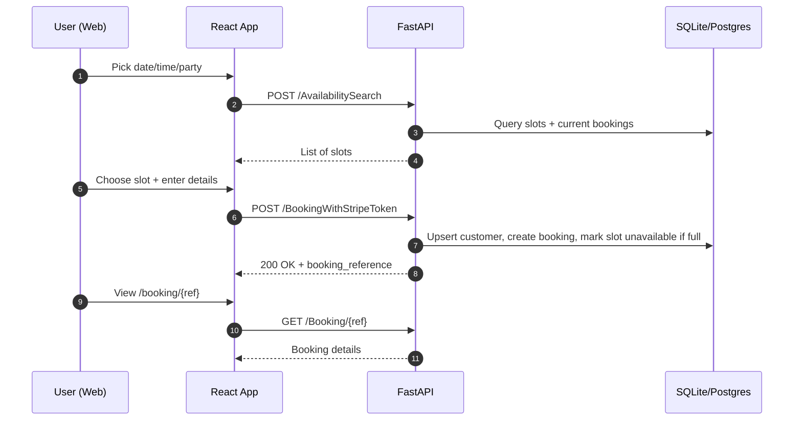

# Architecture & Design

## High-Level

- **Client** (React/Vite) calls FastAPI via REST. Axios instance handles base URL and optional bearer token.
- **API** (FastAPI/Uvicorn) uses SQLAlchemy ORM. SQLite for dev, swap to Postgres in prod.
- **Auth** (mock): single fixed bearer token for owner/admin features. Customers do not need accounts in this demo.
- **Availability logic**: Pre-seeded `availability_slots`. Each slot can take up to N concurrent bookings; bookings toggle slot availability and count.

### Sequence (Booking happy path)


## Data Integrity Rules

- A time slot is bookable only if `slot.available == true` **and** current confirmed bookings < capacity.
- On successful booking, we enqueue/toggle the slot availability accordingly. On cancellation, we release it.
- Updates to cancelled bookings are rejected.

## Frontend Decisions

- **Vite + React + TS:** fast dev, typed safety
- **Tailwind:** consistent theme, quick responsiveness
- **React Router:** client-side routes for Home/Availability/Booking/Lookup/Details/Dashboard
- **AuthContext + localStorage:** minimal admin session handling
- **Accessible UI:** focus rings, sufficient contrast, keyboardable controls

## Backend Decisions

- **FastAPI:** declarative routes + Pydantic validation
- **SQLite** for dev simplicity; migrate to **Postgres** in prod
- **SQLAlchemy:** clear models & relationships
- **CORS** enabled for local dev (`http://localhost:5173`)

## Scaling & Reliability (Prod)

- **Stateless API** containers behind an ALB. Horizontal autoscaling on CPU/RAM.
- **DB**: Managed Postgres (multi-AZ), point-in-time recovery; read replicas if needed.
- **Caching**: CloudFront for static; Redis for API hot paths or rate limiting if necessary.
- **Observability**: structured logs, metrics, distributed traces.
- **Security**: HTTPS everywhere (ACM), WAF, Secrets Manager, least-priv IAM, input validation, rate limits.

## Minimal Cloud Reference (AWS)

```mermaid
flowchart LR
  A[Route 53] --> CF[CloudFront + S3 (Frontend)]
  A --> ALB[ALB]
  ALB --> ECS[ECS/Fargate (FastAPI)]
  ECS --> RDS[(RDS Postgres)]
  ECS --> Redis[[ElastiCache Redis]]
  CF -->|static| User[(Browser)]
  User --> ALB
  WAF[WAF] --> ALB
  SM[Secrets Manager] --> ECS
```

- **CI/CD**: GitHub Actions → build & push Docker image → deploy to ECS; build frontend → upload to S3 → invalidate CloudFront.
- **TLS**: ACM certs on ALB & CloudFront.

## Security Notes

- Replace mock token with real owner auth (e.g., username/password + JWT with refresh).
- Per‑booking access: signed lookup links (HMAC or short‑lived JWT with `booking_reference` claim).
- Audit logging for booking state changes.
